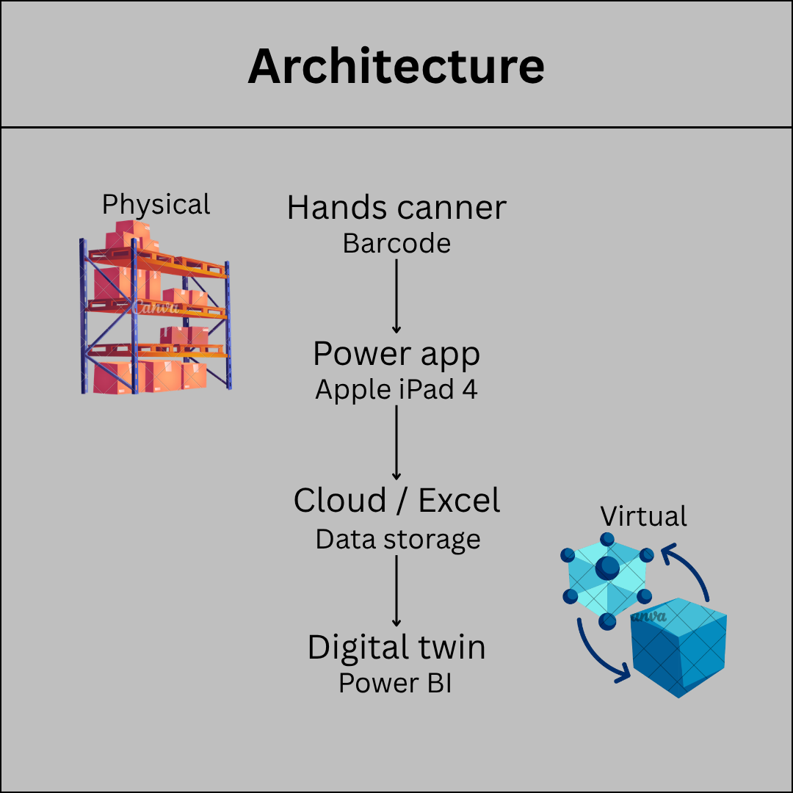

# Grootste titel From Physical Warehouse to Digital Twin

### Subtitel Current Architecture

Data collection starts on the warehouse floor. A handheld scanner connected to a Power Apps application on an iPad is used to capture the data. The data is then stored in a cloud-based Excel file and integrated into the Digital Twin in Power BI for analysis and visualization. The current limitation of this architecture is the cloud dependency: The data collection process requires a stable internet connection. If connectivity is lost, data collection can de interrupted.

